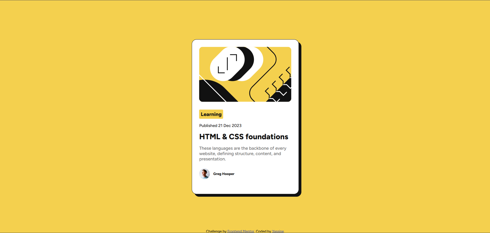

# Frontend Mentor - QR code component solution

This is a solution to the [Blog preview card challenge on Frontend Mentor](https://www.frontendmentor.io/challenges/blog-preview-card-ckPaj01IcS). Frontend Mentor challenges help you improve your coding skills by building realistic projects. 

## Table of contents

- [Overview](#overview)
  - [Screenshot](#screenshot)
  - [Links](#links)
  - [Built with](#built-with)
  - [Useful resources](#useful-resources)
- [Author](#author)
- [Acknowledgments](#acknowledgments)

## Overview

### Screenshot

### Links

- GitHub Solution URL: [https://github.com/mansourYassine/blog-preview-card.git](https://github.com/mansourYassine/blog-preview-card.git)
- Live Site URL: [https://mansouryassine.github.io/blog-preview-card/](https://mansouryassine.github.io/blog-preview-card/)

### Built with

- Semantic HTML5
- Css 3

### Useful resources

- [Resource 1: ](https://elzero.org/) - Elzero web school
- [Resource 2: ](https://www.w3schools.com/) - w3schools
- [Resource 3: ](https://developer.mozilla.org/) - MDN

## Author

- Frontend Mentor - [@mansourYassine](https://www.frontendmentor.io/profile/mansourYassine)

## Acknowledgments

Elzero web school - this YouTuber taught me the majority of my CSS knowledge.